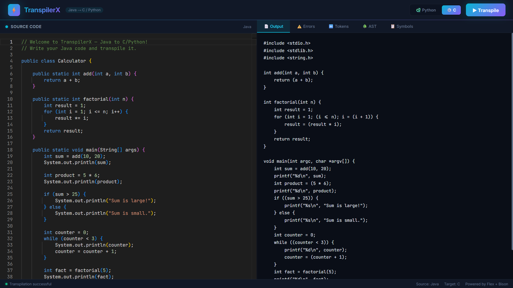
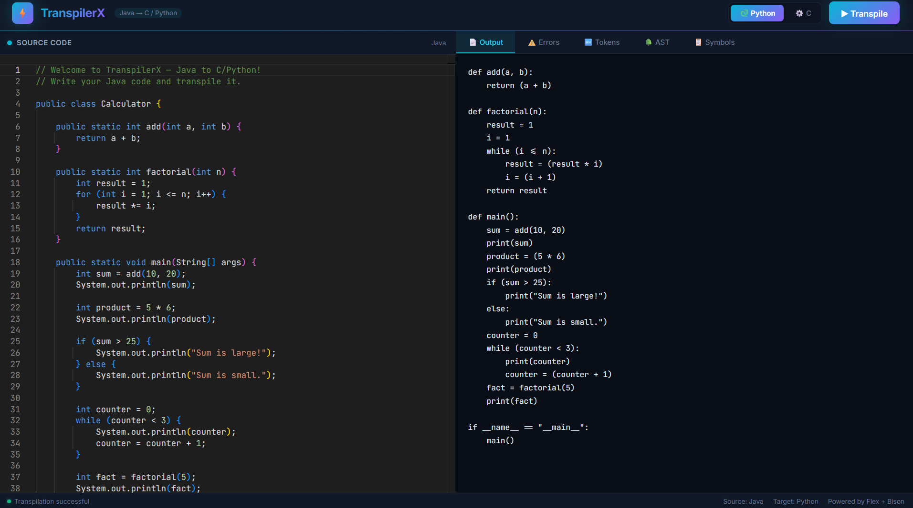
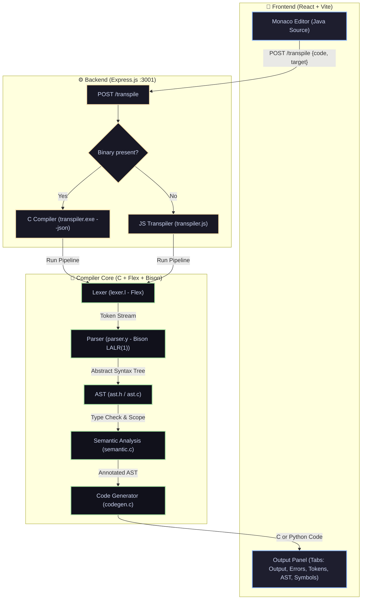
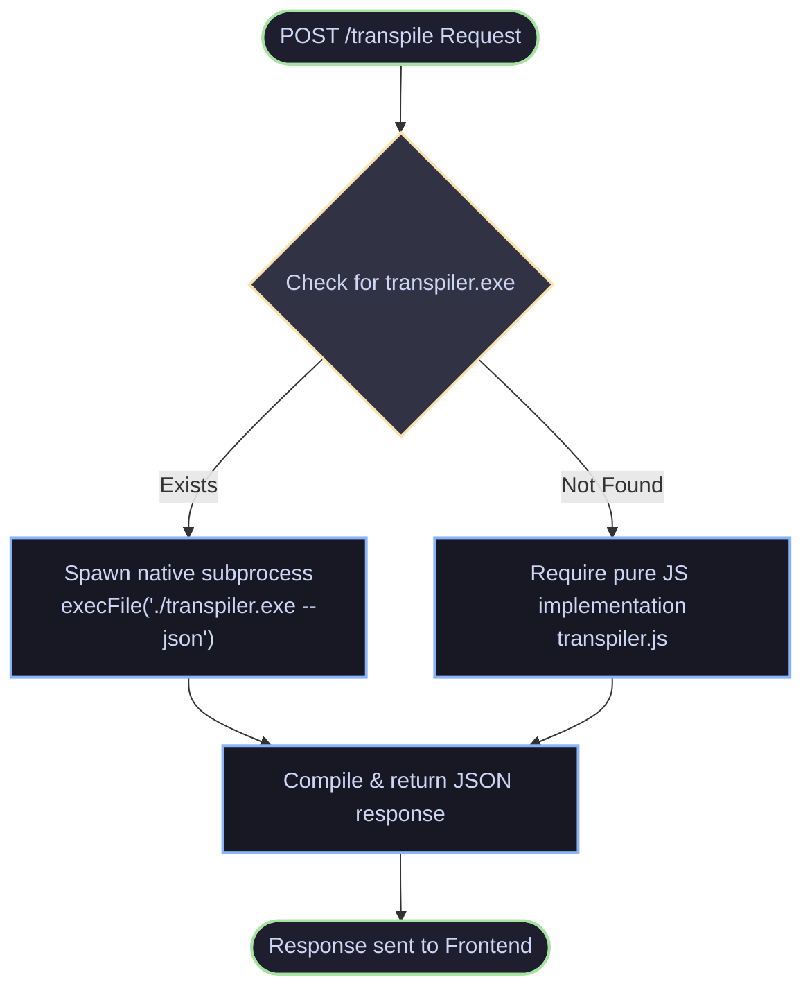

# 🚀 TranspilerX — Java to C/Python Transpiler

A full-stack, source-to-source compiler pipeline that transforms a subset of **Java** source code into equivalent, optimized **C** or **Python** output.

[](https://opensource.org/licenses/MIT)
[]()
[]()
[]()

---

## ✨ Visual Showcase

| 💻 Java to C Transpilation | 🐍 Java to Python Transpilation |
| :---: | :---: |
|  |  |

---

<details>
  <summary><strong>📖 Table of Contents (Click to expand)</strong></summary>
  <br/>

  - [🔍 1. Project Overview](#1-project-overview)
  - [🏗️ 2. Architecture](#2-architecture)
  - [📁 3. Directory Structure](#3-directory-structure)
  - [⚙️ 4. Compilation Pipeline Workflow](#4-compilation-pipeline-workflow)
  - [🔤 5. Phase 1 — Lexical Analysis](#5-phase-1--lexical-analysis)
  - [📊 6. Phase 2 — Syntax Analysis Grammar](#6-phase-2--syntax-analysis-grammar)
  - [📐 7. Syntax-Directed Definitions (SDD)](#7-syntax-directed-definitions-sdd)
  - [🎛️ 8. Syntax-Directed Translation (SDT)](#8-syntax-directed-translation-sdt)
  - [🔒 9. Semantic Rules and Actions](#9-semantic-rules-and-actions)
  - [💻 10. Phase 4 — Code Generation](#10-phase-4--code-generation)
  - [🌳 11. AST Node Taxonomy](#11-ast-node-taxonomy)
  - [🎨 12. Frontend Architecture](#12-frontend-architecture)
  - [🔌 13. Backend API](#13-backend-api)
</details>

---

## 🔍 1. Project Overview

**TranspilerX** is a full-stack source-to-source compiler (transpiler) that accepts a subset of **Java** as input and produces equivalent code in either **C** or **Python**.

| Property | Value |
|---|---|
| **Source Language** | Java (subset) |
| **Target Languages** | C, Python |
| **Compiler Core** | C + Flex (lexer) + Bison (LALR parser) |
| **JS Fallback** | Node.js (mirrors C compiler pipeline) |
| **Frontend UI** | React + Vite + Monaco Editor |
| **Backend API** | Express.js (Node.js) |

### 🛠️ Supported Java Constructs

- **Object-Oriented Structures**: `class` declarations with access modifiers (`public`, `private`, `protected`) and static methods with typed parameters.
- **Control Flow**: Conditional blocks (`if / else if / else`), and loops (`while`, `for`).
- **Variables & Data Types**: Typed variable declarations (e.g., `int x = 10;`, `String s = "hello";`), type casts (e.g., `(int) x`), and method/function calls.
- **Arrays**: Support for array types, allocation, and bracket-index slot accesses (e.g., `int[]`, `new int[n]`, `arr[i]`).
- **Standard I/O**: Print actions via `System.out.println()` and `System.out.print()`.
- **Operators**: Comprehensive set of arithmetic, relational, logical, bitwise, compound assignment (`+=`, `-=`, `*=`, `/=`), and increment/decrement (`++`, `--`) operations.

---

## 🏗️ 2. Architecture



---

## 📁 3. Directory Structure

```text
📁 transpiler-project/
├── 📂 compiler/             # Core C transpiler files
│   ├── 📄 lexer.l          # Flex lexer specification (Java tokenizer)
│   ├── 📄 parser.y         # Bison parser specification (Java grammar & SDT)
│   ├── 📄 ast.h / ast.c    # AST definitions & JSON serializer
│   ├── 📄 symtab.h / .c    # Scoped Symbol Table implementation
│   ├── 📄 semantic.h / .c  # Type checking & semantic validation passes
│   ├── 📄 codegen.h / .c   # Target code generation (C & Python emitters)
│   ├── 📄 main.c           # Compiler CLI entry point with JSON output mode
│   └── 📄 Makefile         # GNU Make script for building the binary
├── 📂 backend/              # Node.js API Service
│   ├── 📄 server.js        # Express API server (/transpile, /health)
│   └── 📄 transpiler.js    # Pure Javascript transpiler fallback
└── 📂 frontend/             # React SPA Interface
    └── 📂 src/
        ├── 📄 App.jsx      # Main React application component
        └── 📄 index.css    # Global styling (Dark Mode)
```

---

## ⚙️ 4. Compilation Pipeline Workflow


---

## 🔤 5. Phase 1 — Lexical Analysis

### Token Classes

| Category | Tokens |
|---|---|
| **Keywords** | `class public private protected static void int double float long char boolean String if else while for return new true false null` |
| **Special Identifiers** | `System.out.println` and `System.out.print` *(each matched as a single token)* |
| **Literals** | `INT_LITERAL`, `DOUBLE_LIT`, `STRING_LIT`, `CHAR_LIT`, `BOOL_LIT` |
| **Identifiers** | `[a-zA-Z_][a-zA-Z0-9_]*` |
| **Arithmetic Operators** | `PLUS`, `MINUS`, `TIMES`, `DIVIDE`, `MODULO` |
| **Relational Operators** | `EQ`, `NEQ`, `LT`, `GT`, `LTE`, `GTE` |
| **Logical Operators** | `AND`, `OR`, `NOT` |
| **Bitwise Operators** | `BITAND`, `BITOR`, `BITXOR`, `BITNOT`, `SHL`, `SHR` |
| **Increment/Decrement** | `INCREMENT`, `DECREMENT` |
| **Compound Assignment** | `PLUS_ASSIGN`, `MINUS_ASSIGN`, `TIMES_ASSIGN`, `DIVIDE_ASSIGN` |
| **Delimiters** | `LPAREN`, `RPAREN`, `LBRACE`, `RBRACE`, `LBRACKET`, `RBRACKET`, `COMMA`, `SEMICOLON`, `DOT` |

### Key Regex Rules (`lexer.l`)

```lex
"System.out.println"         /* -> SYSOUT_PRINTLN (matched before identifiers) */
"System.out.print"           /* -> SYSOUT_PRINT */

[a-zA-Z_][a-zA-Z0-9_]*       /* -> keyword table lookup, else IDENTIFIER */

[0-9]+\.[0-9]+([fFdD])?      /* -> DOUBLE_LIT (atof) */
[0-9]+                       /* -> INT_LITERAL (atoi) */
\"([^"\\]|\\.)*\"            /* -> STRING_LIT (strdup, keeps quotes) */
\'([^'\\]|\\.)*\'            /* -> CHAR_LIT (yytext[1]) */

"++" | "--" | "==" | "!=" | "<=" | ">=" | "&&" | "||" | "<<" | ">>" | "+=" | "-=" | "*=" | "/=" /* -> Compound operators */

"//"                       { skip_line_comment(); }
"/*"                       { skip_block_comment(); }
\n                         { yyline++; }
[ \t\r]+                   { /* skip whitespace */ }
```

---

## 📊 6. Phase 2 — Syntax Analysis Grammar

The parser is **LALR(1)** generated by Bison. Operator precedence rules (lowest to highest):

```yacc
%left  OR                     /* logical or               */
%left  AND                    /* logical and              */
%left  BITOR                  /* bitwise or               */
%left  BITXOR                 /* bitwise xor              */
%left  BITAND                 /* bitwise and              */
%left  EQ  NEQ                /* equality comparison      */
%left  LT  GT  LTE  GTE       /* relational comparison    */
%left  SHL  SHR               /* bitwise shift            */
%left  PLUS  MINUS            /* additive                 */
%left  TIMES  DIVIDE  MODULO  /* multiplicative           */
%right NOT  BITNOT            /* unary logical/bitwise    */
%right UMINUS                 /* unary minus (highest)    */
```

### Grammar Specification (BNF)

```bnf
program       ::= class_list | statement_list

class_list    ::= class_decl | class_list class_decl

class_decl    ::= opt_access_mod class IDENTIFIER { class_body }

class_body    ::= class_member_list

class_member  ::= method_decl | field_decl

method_decl   ::= opt_access_mod opt_static type_spec IDENTIFIER
                  ( opt_param_list ) { statement_list }

field_decl    ::= opt_access_mod opt_static type_spec IDENTIFIER = expr ;
                | opt_access_mod opt_static type_spec IDENTIFIER ;

type_spec     ::= int | double | float | long | char | boolean
                | String | void | int[] | double[] | String[]

statement     ::= var_decl_stmt | assign_stmt | if_stmt | while_stmt
                | for_stmt | return_stmt | print_stmt | expr_stmt

var_decl_stmt ::= type_spec IDENTIFIER = expression ;
                | type_spec IDENTIFIER ;

assign_stmt   ::= IDENTIFIER = expression ;
                | IDENTIFIER OP= expression ;        (compound)
                | IDENTIFIER [ expression ] = expression ;

for_stmt      ::= for ( for_init ; expression ; for_update ) block

for_init      ::= type_spec IDENTIFIER = expression
                | IDENTIFIER = expression

for_update    ::= IDENTIFIER ++  |  IDENTIFIER --  |  ++ IDENTIFIER
                | IDENTIFIER = expression
                | IDENTIFIER += expression

print_stmt    ::= System.out.println ( expression ) ;
                | System.out.print   ( expression ) ;

expression    ::= expression BIN_OP expression
                | ! expression  |  ~ expression  |  - expression
                | postfix_expr

postfix_expr  ::= primary | postfix_expr ++ | postfix_expr --

primary       ::= literal
                | IDENTIFIER ( opt_arg_list )
                | IDENTIFIER . IDENTIFIER ( opt_arg_list )
                | IDENTIFIER [ expression ]
                | new type_spec [ expression ]
                | ( type_spec ) primary
                | IDENTIFIER
                | ( expression )
```

---

## 📐 7. Syntax-Directed Definitions (SDD)

An **SDD** attaches synthesized attributes to every non-terminal. In this implementation, `$$` evaluates to `ASTNode*` except for flags and specific enum outputs.

> [!NOTE]
> - `type_spec` returns a `JavaType` enum value.
> - `opt_access_mod` and `opt_static` return primitive flags / enums.

### Attribute Table

| Non-terminal | Attribute Type | Meaning |
|---|---|---|
| `program`, `class_list`, `statement_list` | `ASTNode*` | Root or list nodes |
| `class_decl`, `method_decl`, `field_decl` | `ASTNode*` | Declaration nodes |
| `statement`, `block`, `expr_stmt` | `ASTNode*` | Statement nodes |
| `expression`, `primary`, `postfix_expr` | `ASTNode*` | Expression nodes |
| `type_spec` | `int` (JavaType enum) | Java type constant |
| `opt_access_mod`, `access_mod` | `int` (AccessMod enum) | Access level modifier |
| `opt_static` | `int` | Static flag (0 or 1) |
| `typed_param`, `opt_param_list`, `param_list` | `ASTNode*` | Parameter metadata nodes |
| `opt_arg_list`, `arg_list` | `ASTNode*` | Argument lists |

### SDD Rules — Class & Method

| Production | Synthesized Attribute `$$` |
|---|---|
| `class_decl → [acc] class id { body }` | `ast_new_class_decl(id, acc, body, line)` |
| `opt_access_mod → ε` | `ACC_DEFAULT` |
| `opt_access_mod → public` | `ACC_PUBLIC` |
| `opt_access_mod → private` | `ACC_PRIVATE` |
| `opt_access_mod → protected` | `ACC_PROTECTED` |
| `opt_static → ε` | `0` |
| `opt_static → static` | `1` |
| `method_decl → [acc] [static] type id (params) {body}` | `ast_new_method_decl(id, type, acc, static, params, body, line)` |
| `field_decl → [acc] [static] type id = expr ;` | `n=ast_new_var_decl(id,type,expr,line); n→access=acc; n→is_static=static` |
| `typed_param → type id` | `ast_new_typed_param(id, type, line)` |

### SDD Rules — Type Specification

| Production | `$$` Value |
|---|---|
| `type_spec → int` | `JTYPE_INT` |
| `type_spec → double` | `JTYPE_DOUBLE` |
| `type_spec → float` | `JTYPE_FLOAT` |
| `type_spec → long` | `JTYPE_LONG` |
| `type_spec → char` | `JTYPE_CHAR` |
| `type_spec → boolean` | `JTYPE_BOOLEAN` |
| `type_spec → String` | `JTYPE_STRING` |
| `type_spec → void` | `JTYPE_VOID` |
| `type_spec → int[]` | `JTYPE_INT_ARRAY` |
| `type_spec → double[]` | `JTYPE_DOUBLE_ARRAY` |
| `type_spec → String[]` | `JTYPE_STRING_ARRAY` |

### SDD Rules — Statements

| Production | `$$` Assignment / Node Mapping |
|---|---|
| `var_decl → type id = expr ;` | `ast_new_var_decl(id, type, expr, line)` |
| `var_decl → type id ;` | `ast_new_var_decl(id, type, NULL, line)` |
| `assign → id = expr ;` | `ast_new_assign(id, expr, line)` |
| `assign → id += expr ;` | `ast_new_assign(id, BinOp(ADD, Ident(id), expr), line)` |
| `assign → id -= expr ;` | `ast_new_assign(id, BinOp(SUB, Ident(id), expr), line)` |
| `assign → id *= expr ;` | `ast_new_assign(id, BinOp(MUL, Ident(id), expr), line)` |
| `assign → id /= expr ;` | `ast_new_assign(id, BinOp(DIV, Ident(id), expr), line)` |
| `assign → id[e] = v ;` | `n=ArrayAccess(id,e); n→right=v; ExprStmt(n)` |
| `if → if(e) block` | `ast_new_if(e, block, NULL, line)` |
| `if → if(e) b1 else b2` | `ast_new_if(e, b1, b2, line)` |
| `if → if(e) b1 else if_stmt` | `ast_new_if(e, b1, if_stmt, line)` |
| `while → while(e) block` | `ast_new_while(e, block, line)` |
| `for → for(init;cond;upd) block` | `ast_new_for(init, cond, upd, block, line)` |
| `return → return expr ;` | `ast_new_return(expr, line)` |
| `return → return ;` | `ast_new_return(NULL, line)` |
| `print → System.out.println(e);` | `ast_new_print(e, line)` |
| `print → System.out.println();` | `ast_new_print(StrLit("\"\""), line)` |

### SDD Rules — For-Update (Desugared)

| Production | `$$` Desugaring Structure |
|---|---|
| `for_update → id++` | `Assign(id, BinOp(ADD, Ident(id), IntLit(1)))` |
| `for_update → id--` | `Assign(id, BinOp(SUB, Ident(id), IntLit(1)))` |
| `for_update → ++id` | `Assign(id, BinOp(ADD, Ident(id), IntLit(1)))` |
| `for_update → id += e` | `Assign(id, BinOp(ADD, Ident(id), e))` |

### SDD Rules — Expressions

| Production | `$$` Constructor Call |
|---|---|
| `expr → expr + expr` | `ast_new_binop(OP_ADD, left, right, line)` |
| `expr → expr - expr` | `ast_new_binop(OP_SUB, ...)` |
| `expr → expr * expr` | `ast_new_binop(OP_MUL, ...)` |
| `expr → expr / expr` | `ast_new_binop(OP_DIV, ...)` |
| `expr → expr % expr` | `ast_new_binop(OP_MOD, ...)` |
| `expr → expr == expr` | `ast_new_binop(OP_EQ, ...)` |
| `expr → expr != expr` | `ast_new_binop(OP_NEQ, ...)` |
| `expr → expr < expr` | `ast_new_binop(OP_LT, ...)` |
| `expr → expr > expr` | `ast_new_binop(OP_GT, ...)` |
| `expr → expr <= expr` | `ast_new_binop(OP_LTE, ...)` |
| `expr → expr >= expr` | `ast_new_binop(OP_GTE, ...)` |
| `expr → expr && expr` | `ast_new_binop(OP_AND, ...)` |
| `expr → expr \|\| expr` | `ast_new_binop(OP_OR, ...)` |
| `expr → expr & expr` | `ast_new_binop(OP_BITAND, ...)` |
| `expr → expr \| expr` | `ast_new_binop(OP_BITOR, ...)` |
| `expr → expr ^ expr` | `ast_new_binop(OP_BITXOR, ...)` |
| `expr → expr << expr` | `ast_new_binop(OP_SHL, ...)` |
| `expr → expr >> expr` | `ast_new_binop(OP_SHR, ...)` |
| `expr → ! expr` | `ast_new_unaryop(OP_NOT, expr, line)` |
| `expr → ~ expr` | `ast_new_unaryop(OP_BITNOT, expr, line)` |
| `expr → - expr` | `ast_new_unaryop(OP_NEG, expr, line)` |
| `postfix → postfix++` | `ast_new_unaryop(OP_INCREMENT, expr, line)` |
| `postfix → postfix--` | `ast_new_unaryop(OP_DECREMENT, expr, line)` |

### SDD Rules — Primary

| Production | `$$` Constructor Call |
|---|---|
| `primary → INT_LITERAL` | `ast_new_int_lit(ival, line)` |
| `primary → DOUBLE_LIT` | `ast_new_double_lit(dval, line)` |
| `primary → STRING_LIT` | `ast_new_str_lit(sval, line)` |
| `primary → CHAR_LIT` | `ast_new_char_lit(cval, line)` |
| `primary → BOOL_LIT` | `ast_new_bool_lit(bval, line)` |
| `primary → id(args)` | `ast_new_func_call(id, args, line)` |
| `primary → id.id(args)` | `ast_new_method_call(obj, method, args, line)` |
| `primary → id[expr]` | `ast_new_array_access(id, expr, line)` |
| `primary → new type[expr]` | `ast_new_new_array(type, size, line)` |
| `primary → (type) primary` | `ast_new_cast(type, expr, line)` |
| `primary → IDENTIFIER` | `ast_new_ident(name, line)` |
| `primary → (expr)` | `expr` (passthrough) |

---

## 🎛️ 8. Syntax-Directed Translation (SDT)

An **SDT** embeds semantic actions directly within grammatical productions. Bison executes these actions when a rule is **reduced**. Below are the primary compiler-action rules:

### SDT Scheme — Class Declaration

```yacc
class_decl:
    opt_access_mod CLASS IDENTIFIER LBRACE class_body RBRACE
    {
        /* Action fires AFTER reducing the full class body.
           $1 = AccessMod enum value
           $3 = char* (identifier, strdup'd by lexer)
           $5 = ASTNode* (stmt list of members)           */
        $$ = ast_new_class_decl($3, (AccessMod)$1, $5, yyline);
    }
```

### SDT Scheme — Method Declaration

```yacc
method_decl:
    opt_access_mod opt_static type_spec IDENTIFIER
    LPAREN opt_param_list RPAREN
    LBRACE statement_list RBRACE
    {
        /* $1=AccessMod  $2=is_static(0/1)  $3=JavaType
           $4=name       $6=params          $9=body       */
        $$ = ast_new_method_decl($4, (JavaType)$3,
                 (AccessMod)$1, $2, $6, $9, yyline);
    }
```

### SDT Scheme — Compound Assignment Desugaring

```yacc
assign_stmt:
    IDENTIFIER PLUS_ASSIGN expression SEMICOLON
    {
        /*  id += e  is translated inline to  id = id + e
           A fresh Ident node is created for the LHS of BinOp
           so the tree does not share pointers.             */
        $$ = ast_new_assign($1,
            ast_new_binop(OP_ADD,
                ast_new_ident(strdup($1), yyline),   /* fresh copy */
                $3, yyline),
            yyline);
    }
```

### SDT Scheme — For-Update (`i++` → assignment)

```yacc
for_update:
    IDENTIFIER INCREMENT
    {
        /* i++  becomes  i = i + 1  (structurally)
           This normalises all loop updates to assignments
           so the code generator handles a single AST form. */
        $$ = ast_new_assign($1,
            ast_new_binop(OP_ADD,
                ast_new_ident(strdup($1), yyline),
                ast_new_int_lit(1, yyline),
                yyline),
            yyline);
    }
```

### SDT Scheme — Array Slot Assignment

```yacc
assign_stmt:
    IDENTIFIER LBRACKET expression RBRACKET ASSIGN expression SEMICOLON
    {
        /* arr[i] = val
           ArrayAccess node reuses its `right` field for the value
           when used as an LHS. Wrapped in ExprStmt.           */
        ASTNode *access = ast_new_array_access($1, $3, yyline);
        access->right   = $6;
        $$ = ast_new_expr_stmt(access, yyline);
    }
```

### SDT Scheme — Statement List (growing list)

```yacc
statement_list:
    statement
    {
        $$ = ast_new_stmt_list();   /* allocate new list */
        ast_add_item($$, $1);       /* add first item    */
    }
  | statement_list statement
    {
        ast_add_item($1, $2);       /* grow existing list */
        $$ = $1;                    /* propagate same ptr */
    }
```

### SDT Scheme — Print Statement

```yacc
print_stmt:
    SYSOUT_PRINTLN LPAREN expression RPAREN SEMICOLON
    {
        /* Generic print node — target (printf vs print)
           is decided during code generation, not here.  */
        $$ = ast_new_print($3, yyline);
    }
  | SYSOUT_PRINTLN LPAREN RPAREN SEMICOLON
    {
        /* println() with no args → print empty string   */
        $$ = ast_new_print(
            ast_new_str_lit(strdup("\"\""), yyline), yyline);
    }
```

---

## 🔒 9. Semantic Rules and Actions

The semantic validation step is a **post-parse, depth-first tree walk** defined in `semantic.c`. It leverages a **linked chain of scoped hash maps** (`SymbolTable`) for identifier resolution.

### 9.1 Symbol Table Layout

```c
typedef struct Symbol {
    char       *name;           /* identifier name (heap allocated) */
    SymbolType  type;           /* SYM_VARIABLE | SYM_FUNCTION | SYM_CLASS */
    JavaType    java_type;      /* JTYPE_INT, JTYPE_STRING, etc. */
    int         param_count;    /* parameter count (functions) */
    int         line_declared;  /* source declaration line */
    int         is_static;      /* static attribute boolean */
    AccessMod   access;         /* public/private/protected access */
    struct Symbol *next;        /* hash chain (separate chaining) */
} Symbol;

typedef struct SymbolTable {
    Symbol      *buckets[211];  /* djb2 hash, 211 buckets */
    SymbolTable *parent;        /* enclosing scope pointer */
} SymbolTable;
```

**Lookup** traverses the parent pointers upward until an identifier is found or the global scope is exhausted.

### 9.2 Scope Management

| Scope Trigger Event | Action taken |
|---|---|
| **Program Start** | Create global `SymbolTable`; set `current_scope = global` |
| **Enter `ClassDecl`** | `push(new SymbolTable(parent=current_scope))` |
| **Exit `ClassDecl`** | `pop();` destroy class scope |
| **Enter `MethodDecl`** | `push(new SymbolTable(parent=class_scope))` |
| **Insert Parameters** | `symtab_insert(method_scope, param.name, SYM_VARIABLE, param.java_type, ...)` |
| **Exit `MethodDecl`** | `pop();` destroy method scope |
| **Enter/Exit `block`** | Simplified: mapped directly to enclosing method scope |

---

### 📋 9.3 Semantic Rules (Formal Specification)

> [!IMPORTANT]
> Semantic checking runs post-parse to guarantee standard Java static rules are validated.

#### 🔴 SR-1 — No Duplicate Class Declaration
- **Context (`WHERE`)**: `node.type == NODE_CLASS_DECL`
- **Precondition (`PRE`)**: `symtab_lookup_local(current_scope, node.name) == NULL`
- **Action (`ACTION`)**: `symtab_insert(current_scope, node.name, SYM_CLASS, JTYPE_UNKNOWN, 0, node.line)`
- **Violation Error**: `"Class 'X' already declared (line N)"`

#### 🔴 SR-2 — No Duplicate Method
- **Context (`WHERE`)**: `node.type == NODE_METHOD_DECL`
- **Precondition (`PRE`)**: `symtab_lookup_local(current_scope, node.name) == NULL`
- **Action (`ACTION`)**: 
  ```c
  sym = symtab_insert(scope, name, SYM_FUNCTION, returnType, paramCount, line);
  sym->is_static = node.is_static;
  sym->access = node.access;
  ```
- **Violation Error**: `"Method 'X' already declared (line N)"`

#### 🔴 SR-3 — No Duplicate Variable in Same Scope
- **Context (`WHERE`)**: `node.type == NODE_VAR_DECL`
- **Precondition (`PRE`)**: `symtab_lookup_local(current_scope, node.name) == NULL`
- **Action (`ACTION`)**: `symtab_insert(scope, name, SYM_VARIABLE, node.java_type, 0, line)`
- **Violation Error**: `"Variable 'X' already declared in this scope (line N)"`

#### 🔴 SR-4 — Variable Must Be Declared Before Use
- **Context (`WHERE`)**: `node.type == NODE_IDENT` *(inside expressions)*
- **Precondition (`PRE`)**: `symtab_lookup(current_scope, node.name) != NULL`
- **Action (`ACTION`)**: `node->java_type = sym->java_type` *(type annotation)*
- **Violation Error**: `"Undeclared identifier 'X'"`

#### 🔴 SR-5 — Assignment Target Checks
- **Context (`WHERE`)**: `node.type == NODE_ASSIGN`
- **Check 1**: `symtab_lookup(scope, node.name) != NULL` (Undeclared error)
- **Check 2**: `sym->type != SYM_FUNCTION` (Cannot assign to method error)

#### 🔴 SR-6 — Function Call Arity and Name Check
- **Context (`WHERE`)**: `node.type == NODE_FUNC_CALL`
- **Check 1**: `symtab_lookup(scope, node.name) != NULL` (Undeclared method)
- **Check 2**: `sym->type == SYM_FUNCTION` (Not a method)
- **Check 3**: `actual_arg_count == sym->param_count` (Expects N arguments, got M)

#### 🔴 SR-7 — Array Subscript Pre-declaration Check
- **Context (`WHERE`)**: `node.type == NODE_ARRAY_ACCESS`
- **Precondition**: `symtab_lookup(scope, node.name) != NULL`
- **Violation Error**: `"Undeclared array 'X'"`

#### 🔴 SR-8 — Object Method Calls
- **Context (`WHERE`)**: `node.type == NODE_METHOD_CALL`
- **Behavior**: Recursively analyze all call arguments; skip parent object validation (open-world runtime lookup assumption).

---

### 9.4 Type Annotation

`SR-4` propagates the declared type onto the `NODE_IDENT` tree nodes:

```c
case NODE_IDENT: {
    Symbol *sym = symtab_lookup(current_scope, node->name);
    if (!sym) {
        add_error(node->line, "Undeclared identifier '%s'", node->name);
    } else {
        node->java_type = sym->java_type;  /* annotation */
    }
}
```

This annotated type information is read by the code generator to select appropriate printf specifiers.

### 9.5 Error Strategy

The semantic parser implements **non-fatal error collection** (up to `MAX_ERRORS = 100`). It continues structural checks after an error occurs to capture all warnings/errors in a single run. Code generation is blocked if `error_count > 0`.

```c
typedef struct SemanticResult {
    SemanticError errors[MAX_ERRORS];   /* array of {line, message[256]} */
    int           error_count;
    SymbolTable  *global_scope;         /* global context mapping */
} SemanticResult;
```

---

## 💻 10. Phase 4 — Code Generation

### 10.1 Java Type → C Type

| Java Type | C Core Representation |
|---|---|
| `int` | `int` |
| `long` | `long` |
| `double` | `double` |
| `float` | `float` |
| `char` | `char` |
| `boolean` | `int` *(C has no native boolean type)* |
| `String` | `const char*` |
| `void` | `void` |
| `int[]` | `int*` |
| `double[]` | `double*` |
| `String[]` | `const char**` |

### 10.2 Java Type → Python Type Hint

| Java Type | Python Hint Representation |
|---|---|
| `int`, `long` | `int` |
| `double`, `float` | `float` |
| `char` | `str` |
| `boolean` | `bool` |
| `String` | `str` |
| Arrays | `list` |

### 10.3 printf Format Specifiers (C Output)

Specifier logic is evaluated dynamically based on `infer_type(expr_node)`:

| Java Type | Format Specifier |
|---|---|
| `int`, `boolean` | `%d` |
| `long` | `%ld` |
| `double`, `float` | `%f` |
| `char` | `%c` |
| `String` | `%s` |

### 10.4 Control Flow Mappings

| Java Structure | C Target Output | Python Target Output |
|---|---|---|
| `if (c) { }` | `if (c) { }` | `if c:` |
| `else if (c) { }` | `else if (c) { }` | `elif c:` |
| `else { }` | `else { }` | `else:` |
| `while (c) { }` | `while (c) { }` | `while c:` |
| `for (int i=0; i<n; i++) {}` | `for (int i=0; (i<n); i=(i+1)) {}` | `i=0` → `while (i<n):` → `i=(i+1)` |

> [!TIP]
> **Python Loop Desugaring**: Java's C-style `for` loop has no direct Python equivalent. The transpiler desugars it into a block consisting of an initialization statement, a `while` loop, and appends the loop update statement at the end of the `while` body.

### 10.5 Literal and Keyword Mappings

| Java | C | Python |
|---|---|---|
| `true` | `1` | `True` |
| `false` | `0` | `False` |
| `null` | `NULL` | `None` |
| `new int[n]` | `(int*)calloc(n, sizeof(int))` | `[0] * n` |
| `(double) x` | `(double)(x)` | `float(x)` |
| `(int) x` | `(int)(x)` | `int(x)` |

### 10.6 Logical Operator Mappings

| Java | C | Python |
|---|---|---|
| `&&` | `&&` | `and` |
| `\|\|` | `\|\|` | `or` |
| `!` | `!` | `not ` |

### 10.7 Class Unwrapping (Java → Flat C Target)

Java classes serve as namespace containers. The backend flattens them into direct C declarations:

```text
ALGORITHM:
1. For each ClassDecl in AST:
   a. First pass  → Emit non-main static methods as flat C functions.
   b. Static fields → Map as global variables.
   c. Second pass → Emit main() with C signature:
                    "void main(int argc, char *argv[])"
                    + Automatically append a "return 0;" statement.
2. Non-class (loose) statements → Wrap immediately in "int main() { ... }"
```

#### Transpilation Example

```java
public class Calc {
    public static int add(int a, int b) { 
        return a + b; 
    }
    public static void main(String[] args) {
        System.out.println(add(1, 2));
    }
}
```

```c
#include <stdio.h>
#include <stdlib.h>
#include <string.h>

int add(int a, int b) {
    return (a + b);
}

void main(int argc, char *argv[]) {
    printf("%d\n", add(1, 2));
    return 0;
}
```

```python
def add(a, b):
    return (a + b)

def main():
    print(add(1, 2))

if __name__ == "__main__":
    main()
```

---

## 🌳 11. AST Node Taxonomy

### Node Type System

| Node Type | Key Fields | Description |
|---|---|---|
| `NODE_PROGRAM` | `items[]` | Top-level list |
| `NODE_STMT_LIST` | `items[]`, `item_count` | Generic statement/node collection |
| `NODE_CLASS_DECL` | `name`, `access`, `body` | Class declaration metadata |
| `NODE_METHOD_DECL` | `name`, `java_type`, `access`, `is_static`, `left`(params), `body` | Method declaration metadata |
| `NODE_VAR_DECL` | `name`, `java_type`, `access`, `is_static`, `left`(init) | Variable declaration |
| `NODE_ASSIGN` | `name`, `left`(value) | Variable assignment |
| `NODE_IF` | `left`(cond), `body`(then), `right`(else/elif) | Conditional block |
| `NODE_WHILE` | `left`(cond), `body` | While loop |
| `NODE_FOR` | `init`, `left`(cond), `update`, `body` | For loop |
| `NODE_RETURN` | `left`(expr/NULL) | Return statement |
| `NODE_PRINT` | `left`(expr) | Print instruction |
| `NODE_EXPR_STMT` | `left`(expr) | Plain expression evaluated as a statement |
| `NODE_BINOP` | `op`, `left`, `right` | Binary math/relational node |
| `NODE_UNARYOP` | `op`, `left` | Unary expression node |
| `NODE_INT_LIT` | `int_val` | Integer value |
| `NODE_DOUBLE_LIT` | `num_val` | Floating-point value |
| `NODE_STR_LIT` | `name` (with quotes) | String value |
| `NODE_CHAR_LIT` | `int_val` | Char representation |
| `NODE_BOOL_LIT` | `int_val` (0/1) | Boolean mapping |
| `NODE_IDENT` | `name`, `java_type` (annotated) | Symbol reference |
| `NODE_FUNC_CALL` | `name`, `left`(arguments) | Routine call |
| `NODE_METHOD_CALL` | `name` ("obj.method"), `left`(arguments) | Method accessor call |
| `NODE_ARRAY_ACCESS` | `name`, `left`(index), `right`(value if LHS) | Subscript array slot read/write |
| `NODE_NEW_ARRAY` | `java_type`, `left`(size) | Dynamic array instance alloc |
| `NODE_CAST` | `java_type`, `left`(expr) | Type coercion node |
| `NODE_TYPED_PARAM` | `name`, `java_type` | Parameter template metadata |

---

### AST Visualizations

#### AST Example — `int x = add(a, b);`

```text
VarDecl (name="x", java_type=JTYPE_INT)
└── 📁 left: FuncCall (name="add")
    └── 📁 left: StmtList (arguments)
        ├── 📄 [0]: Identifier (name="a", java_type=JTYPE_INT)
        └── 📄 [1]: Identifier (name="b", java_type=JTYPE_INT)
```

#### AST Example — `for (int i = 0; i < n; i++) { ... }`

```text
For
├── ⚙️ init: VarDecl (name="i", java_type=JTYPE_INT)
│            └── 📁 left: IntLit (value=0)
│
├── ⚙️ left (condition): BinOp (op=OP_LT)
│                       ├── 📄 left: Identifier (name="i")
│                       └── 📄 right: Identifier (name="n")
│
├── ⚙️ update: Assign (name="i")
│             └── 📁 left: BinOp (op=OP_ADD)
│                         ├── 📄 left: Identifier (name="i")
│                         └── 📄 right: IntLit (value=1)
│
└── 📁 body: StmtList
             └── ...
```

#### AST Example — `if (x > 0) { ... } else { ... }`

```text
If
├── ⚙️ left (condition): BinOp (op=OP_GT)
│                       ├── 📄 Identifier (name="x")
│                       └── 📄 IntLit (value=0)
├── 📁 body (then): StmtList [...]
└── 📁 right (else): StmtList [...]
```

---

## 🎨 12. Frontend Architecture

```text
App.jsx
├── 💾 State Management
│   ├── code       # Java source string
│   ├── target     # "python" | "c"
│   ├── result     # { success, tokens, ast, symbols, errors, output }
│   ├── loading    # boolean
│   └── activeTab  # "output" | "errors" | "tokens" | "ast" | "symbols"
│
├── ⚙️ API Integration
│   └── handleTranspile() -> POST /transpile { code, target }
│
├── 💻 Monaco Editor Instance
│   ├── Language: Java (syntax highlighting)
│   ├── Font: JetBrains Mono
│   └── Features: Bracket-pair coloring, line highlight, smooth cursor
│
├── 🌳 ASTTreeView Component (Recursive)
│   ├── node.type      -> Cyan Label
│   ├── node.name      -> Orange identifier
│   ├── node.javaType  -> Subscript type annotation (e.g. ": int")
│   ├── node.value     -> Green literal representation
│   └── node.op        -> Red operator representation
│
└── 📑 Output Tabs Interface
    ├── Output     # Monospace generated target code
    ├── Errors     # Compilation error list with line details
    ├── Tokens     # High-density lexical token grid
    ├── AST        # Recursive tree view of the parsed AST
    └── Symbols    # Interactive symbol table view
```

---

## 🔌 13. Backend API

### `POST /transpile`

**Request Payload:**
```json
{ 
  "code": "public class Hello { public static void main(String[] args) { System.out.println(\"Hello World\"); } }", 
  "target": "python" 
}
```

**Success JSON Response:**
```json
{
  "success": true,
  "tokens": [
    { "type": "CLASS", "value": "class", "line": 1 }
  ],
  "ast": {
    "type": "Program",
    "items": [{ "type": "ClassDecl", "name": "Hello" }]
  },
  "symbols": [
    { "name": "Hello", "type": "class", "javaType": "class", "params": 0, "line": 1 }
  ],
  "errors": [],
  "output": "class Hello:\n    def main():\n        print(\"Hello World\")\n"
}
```

**Failure JSON Response:**
```json
{
  "success": false,
  "errors": [
    { "line": 3, "message": "Undeclared identifier 'x'" }
  ],
  "output": null
}
```

### `GET /health`

**Response:**
```json
{ 
  "status": "ok", 
  "mode": "javascript" 
}
```

---

### 🔀 Binary vs JS Fallback Execution Path



---

<p align="center">
  <b>TranspilerX — Java to C/Python Transpiler</b><br>
  <i>Built with Flex, Bison, C, Express.js, React, and Monaco Editor.</i>
</p>
